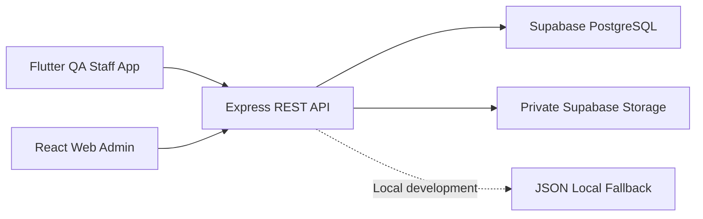

# QA Mobile Apps

QA Mobile Apps is an integrated Quality Assurance system designed to manage **QC Material** and **QC Pekerjaan** workflows.

The system consists of a Flutter application for QA Staff, a React-based Admin Dashboard, an Express API, PostgreSQL, and private object storage.

> **Project status:** Active prototype/demo development. The system is not yet production-ready.

## Live Demo

| Application | User | Demo |
|---|---|---|
| QA Staff Mobile App | QA Staff | [Open Mobile Demo](https://qa-mobile-app.vercel.app/) |
| Web Admin Dashboard | Administrator | [Open Admin Demo](https://qa-mobile-web.vercel.app/) |

Demo credentials are displayed on each application's login page.

> The deployments are intended for demonstration and testing. Authentication, account management, security hardening, and several production requirements are still under development.

## System Overview

QA Mobile Apps supports two main actors:

### QA Staff

QA Staff use the Flutter application to:

- View available QC Material and QC Pekerjaan templates.
- Fill numeric, boolean, choice, and text checklist items.
- Add notes and multiple evidence photos to checklist items.
- Save inspections as drafts.
- Restore and continue previously saved drafts.
- Submit completed inspection reports.
- View report history and report details.
- Monitor inspection summaries through the dashboard.
- Manage basic profile information.

QA Staff record inspection data but do not determine the final pass or fail result.

### Administrator

Administrators use the React Web Dashboard to:

- Monitor Quality Control activity.
- Manage QC Material and QC Pekerjaan templates.
- Review reports submitted by QA Staff.
- Inspect checklist answers, notes, and evidence photos.
- Approve or reject inspection reports.
- Determine the final inspection result.
- Filter reports by location, QC type, status, and standard result.
- View report statistics and dashboard summaries.

## Architecture



The mobile and web applications must not access PostgreSQL tables or private storage credentials directly. Database and object-storage credentials are only configured in the Express backend environment.

## Technology Stack

| Layer | Technology |
|---|---|
| QA Staff Application | Flutter / Dart |
| Admin Dashboard | React / TypeScript |
| Backend API | Node.js / Express |
| Database | Supabase PostgreSQL |
| Evidence Storage | Private Supabase Storage |
| Local Data Fallback | JSON |
| Frontend Deployment | Vercel |
| Version Control | Git / GitHub |

## Repository Structure

```text
QA-APPS-MOBILE/
├── apps/
│   ├── mobile/          # Flutter application for QA Staff
│   └── web/             # React Admin Dashboard
├── mock-api/            # Canonical Express API
├── docs/                # Project and integration documentation
└── README.md
```

The deprecated backend previously located at `apps/mobile/mock-api` must not be used. The canonical backend is located at the repository root in `mock-api`.

## Main Workflows

### QC Material

```text
Admin creates a template
        ↓
QA Staff selects the material
        ↓
QA Staff fills checklist items and evidence
        ↓
Report is saved as Draft or Submitted
        ↓
Admin reviews the submitted report
        ↓
Admin approves or rejects the report
```

### QC Pekerjaan

```text
Admin creates a work template
        ↓
QA Staff selects the work inspection
        ↓
QA Staff fills checklist items and evidence
        ↓
Report is saved as Draft or Submitted
        ↓
Admin reviews the submitted report
        ↓
Admin determines the final result
```

## Evidence Photo Management

Evidence photos can be attached to individual checklist items.

The current implementation supports:

- Camera and gallery selection.
- Multiple photos per checklist item.
- Draft photo persistence.
- Upload retry handling.
- Canonical object-path persistence.
- Private storage through the backend.
- Evidence display in report details.
- Removal of newly selected or restored draft photos.

Stored reports persist canonical object paths instead of temporary signed URLs.

## Local Development

### Prerequisites

Install the following tools:

- Node.js and npm
- Flutter SDK
- Android SDK for Android development
- A supported web browser
- Supabase project access when using PostgreSQL and Storage

### Backend API

```powershell
cd mock-api
npm.cmd install
npm.cmd start
```

The canonical backend runs on:

```text
http://localhost:3002
```

### Web Admin

```powershell
cd apps/web
npm.cmd install
npm.cmd run dev
```

### Flutter Application

```powershell
cd apps/mobile
flutter pub get
flutter run
```

To run the Flutter application in Chrome:

```powershell
flutter run -d chrome
```

## API Access

The API base URL depends on the target platform:

| Platform | Backend URL |
|---|---|
| Flutter Web / Desktop | `http://localhost:3002` |
| Android Emulator | `http://10.0.2.2:3002` |
| Deployed Demo | Configured deployment API URL |

## Environment Configuration

Create the required environment files from the provided examples.

Do not commit:

- Database passwords.
- Supabase service-role keys.
- Storage credentials.
- Access tokens.
- Production secrets.

All database and private storage operations must go through the Express API.

## Current Development Status

Completed or integrated:

- Canonical Express API foundation.
- PostgreSQL schema and repair migrations.
- JSON fallback for local development.
- QC Material and QC Pekerjaan template integration.
- Mobile draft persistence.
- Checklist answer restoration.
- Multiple evidence photos per checklist item.
- Private evidence upload integration.
- Mobile report details.
- Admin report review and approval foundation.
- Flutter and React demo deployments.

Currently being stabilized:

- Mobile report submission timeout handling.
- Duplicate submission prevention.
- End-to-end report synchronization.
- Admin template editing consistency.
- Authentication and account management.
- Production environment configuration.
- Final mobile, web, and backend regression testing.

## Production Readiness

The current deployment is a prototype and still requires:

- Production-grade authentication.
- Role-based authorization.
- Secure account and session management.
- Password recovery.
- Request rate limiting.
- Monitoring and centralized logging.
- Backup and recovery procedures.
- Final security review.
- Full end-to-end and device testing.
- Deployment and operational documentation.

## Documentation

Project documentation is available in the [`docs`](docs/) directory.

Start with the [documentation index](docs/README.md) for architecture, database, storage, integration, and workflow references.

## Project Purpose

This project was developed as an internship project to demonstrate an integrated Quality Assurance workflow across mobile, web, backend, database, and private evidence storage systems.

## License

This repository is currently intended for internal development, demonstration, and evaluation.
