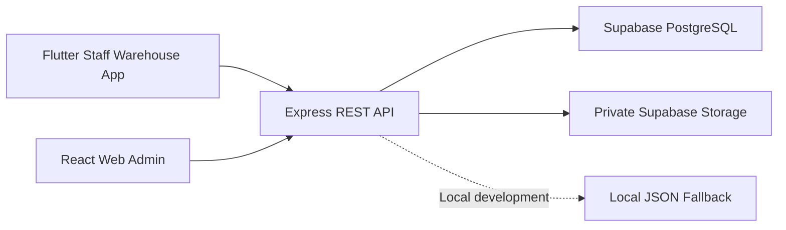

# QA Mobile Apps

QA Mobile Apps is an integrated Quality Assurance system designed to manage **QC Material** and **QC Pekerjaan** workflows.

The system consists of a Flutter application for Staff Warehouse, a React-based Admin Dashboard, an Express API, PostgreSQL, and private object storage.

> **Project status:** Active prototype and pilot-candidate development. The current deployments are not production-ready.

## Live Demo

| Application | User | Demo |
|---|---|---|
| Staff Warehouse Mobile App | Staff Warehouse | [Open Mobile Demo](https://qa-mobile-app.vercel.app/) |
| Web Admin Dashboard | Administrator | [Open Admin Demo](https://qa-mobile-web.vercel.app/) |

Demo credentials are displayed on each application's login page.

> The deployments are intended for demonstration and testing. Authentication, account management, security hardening, and several production requirements are still under development.

## System Overview

QA Mobile Apps supports two main actors:

### Staff Warehouse

Staff Warehouse users use the Flutter application to:

- View available QC Material and QC Pekerjaan templates.
- Fill numeric, boolean, choice, and text checklist items.
- Capture camera-only evidence photos and add notes to checklist items.
- Complete multi-step QC Material inspections with independent data for each sample.
- Save inspections as drafts.
- Restore and continue previously saved drafts.
- Submit completed inspection reports.
- Receive synchronized revision requests, Admin notes, and report statuses.
- View report history and report details.
- Monitor inspection summaries through the dashboard.
- Manage basic profile information.

Staff Warehouse record inspection data but do not determine the final pass or fail result.

### Administrator

Administrators use the React Web Dashboard to:

- Monitor Quality Control activity.
- Manage QC Material and QC Pekerjaan templates.
- Review reports submitted by Staff Warehouse.
- Inspect sample-scoped checklist answers, notes, statuses, and evidence photos.
- Record review decisions and notes independently for each QC Material sample.
- Approve or reject inspection reports.
- Determine the final inspection result.
- View report statistics and dashboard summaries.

## Architecture


```mermaid
flowchart LR
    Mobile["Flutter Staff Warehouse App"]
    Admin["React Web Admin"]
    API["Express REST API"]
    Database["Supabase PostgreSQL"]
    Storage["Private Supabase Storage"]
    JSON["Local JSON Fallback"]

    Mobile --> API
    Admin --> API
    API --> Database
    API --> Storage
    API -. Local development .-> JSON
```

The mobile and web applications must not access PostgreSQL tables or private storage credentials directly. Database and object-storage credentials are only configured in the Express backend environment.

## Technology Stack

| Layer | Technology |
|---|---|
| Staff Warehouse Application | Flutter / Dart |
| Admin Dashboard | React / TypeScript |
| Backend API | Node.js / Express |
| Database | Supabase PostgreSQL |
| Object Storage | Supabase Storage |
| Local Data Fallback | JSON |
| Frontend Deployment | Vercel |
| Version Control | Git / GitHub |

## Repository Structure

```text
QA-APPS-MOBILE/
├── apps/
│   ├── mobile/          # Flutter application for Staff Warehouse
│   └── web/             # React Admin Dashboard
├── mock-api/            # Canonical Express API
├── docs/                # Project and integration documentation
└── README.md            # Root repository orientation
```

The deprecated backend previously located at `apps/mobile/mock-api` must not be used. The canonical backend is located at the repository root in `mock-api`.

## Main Workflows

### QC Material

```text
Admin creates a template
        ↓
Staff Warehouse selects the material
        ↓
Staff Warehouse fills checklist items and evidence
        ↓
Report is saved as Draft or Submitted
        ↓
Admin reviews report
        ↓
Admin approves, rejects, or requests follow-up
```

### QC Pekerjaan

```text
Admin creates a work template
        ↓
Staff Warehouse selects the work inspection
        ↓
Staff Warehouse fills checklist items and evidence
        ↓
Report is saved as Draft or Submitted
        ↓
Admin reviews report
        ↓
Admin approves, rejects, or requests follow-up
```

## Quick Start

### Prerequisites

- Node.js `20.x` or later
- Flutter SDK `3.x` (channel stable)
- Supabase project access when using PostgreSQL and Storage

### Backend API

```powershell
Copy-Item .env.example .env
```

Ensure `.env` contains valid credentials before starting:

```env
PORT=5000
DATA_PROVIDER=supabase
SUPABASE_URL=https://<your-project>.supabase.co
SUPABASE_SERVICE_ROLE_KEY=<your-service-role-key>
SUPABASE_STORAGE_BUCKET=qc-evidence
CORS_ORIGINS=http://localhost:3000,http://localhost:5173,http://localhost:5174
```

Start the API:

```powershell
cd mock-api
npm install
npm run dev
```

The API will run at `http://localhost:5000`.

### Mobile Application

```powershell
cd apps/mobile
flutter pub get
flutter run -d chrome --web-port=5174
```

To specify a custom API URL:

```powershell
flutter run -d chrome --web-port=5174 --dart-define=API_BASE_URL=http://localhost:5000
```

### Web Admin Dashboard

```powershell
cd apps/web
npm install
npm run dev
```

The dashboard will run at `http://localhost:5173`.

---

## Documentation Links

For detailed technical guidelines, architecture maps, and developer procedures, consult the documentation:

- [Project Handover Documentation](docs/HANDOVER.md)
- [Verification and Test Log](docs/TEST_VERIFICATION.md)
- [Architecture Blueprint](docs/ARCHITECTURE.md)
- [Data Mapping Document](docs/DATA_MAPPING.md)
- [API Contract Specification](docs/API_CONTRACT.md)
- [Security Guidelines](docs/SECURITY.md)
