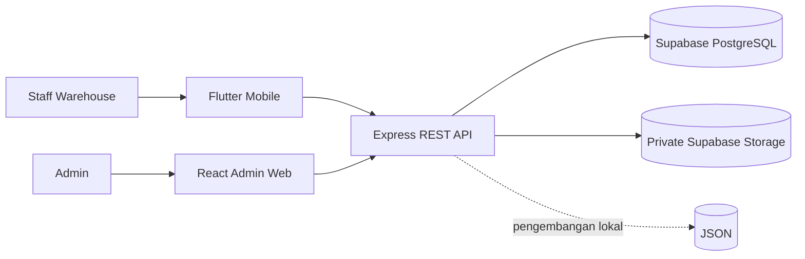

# QA Mobile Apps

QA Mobile Apps adalah prototipe alur **Quality Control (QC)** untuk pemeriksaan
material dan pekerjaan. Staff Warehouse mencatat inspeksi dan bukti melalui
aplikasi Mobile, sedangkan Admin meninjau laporan, meminta tindak lanjut, atau
memberikan persetujuan melalui Admin Web.

> [!WARNING]
> Proyek ini masih berupa **prototipe/demo** dan tidak boleh dianggap aman atau
> siap produksi. Login masih disimulasikan, otorisasi role belum ditegakkan
> end-to-end oleh Backend, dan kebutuhan operasional serta security hardening
> belum lengkap.

> Dokumentasi utama: **[Handover Teknis lengkap](docs/HANDOVER.md)**.

## Demo

| Aplikasi | URL |
|---|---|
| Admin Web | [https://qa-mobile-web.vercel.app](https://qa-mobile-web.vercel.app) |
| Mobile Web | [https://qa-mobile-app.vercel.app](https://qa-mobile-app.vercel.app) |

URL tersebut adalah deployment demo yang terdokumentasi. Repository tidak
membuktikan production branch, Root Directory, Build Command, environment
assignment, domain API, maupun pengaturan Vercel lainnya.

## Komponen utama

| Komponen | Pengguna | Tanggung jawab |
|---|---|---|
| **Flutter Mobile** | `STAFF_WAREHOUSE` | Mengisi QC Material/QC Pekerjaan, mengambil dan memproses bukti foto, menyimpan draft, submit, melihat riwayat, dan menindaklanjuti revisi |
| **React Admin Web** | `ADMIN` | Melihat laporan, meninjau jawaban dan bukti, memberi evaluasi/catatan, meminta revisi, dan menyetujui laporan |
| **Express Backend** | Mobile dan Web | Menyediakan REST API, memvalidasi/menormalisasi data, menangani transaksi laporan dan signed URL, serta menjadi satu-satunya batas akses ke Supabase PostgreSQL dan Storage |

Backend dapat memakai provider JSON untuk pengembangan lokal. Data aplikasi
terintegrasi disimpan di **Supabase PostgreSQL**, sedangkan bukti foto disimpan
sebagai objek privat di **Supabase Storage**.

## Arsitektur dan aliran data


```mermaid
flowchart LR
    S["Staff Warehouse"] --> M["Flutter Mobile"]
    A["Admin"] --> W["React Admin Web"]
    M --> API["Express REST API"]
    W --> API
    API --> DB[("Supabase PostgreSQL")]
    API --> ST[("Private Supabase Storage")]
    API -. "pengembangan lokal" .-> J[("JSON")]
```

Alur ringkas: Staff Warehouse memilih template, mengisi checklist dan bukti,
lalu menyimpan draft atau mengirim laporan. Backend memvalidasi dan menyimpan
laporan serta object path bukti. Admin Web membaca laporan melalui Backend,
meminta signed URL untuk menampilkan bukti privat, kemudian menyimpan hasil
review melalui API. Mobile dan Web tidak mengakses tabel atau kredensial
Storage secara langsung.

## Topologi branch aktif

`main` **bukan** gabungan implementasi terbaru ketiga aplikasi.

| Branch | Isi aktif | Navigasi |
|---|---|---|
| `main` | Titik masuk repository dan dokumentasi | [Buka branch](https://github.com/farrelgaska/QA-Mobile-Apps/tree/main) |
| `feat/mobile-qc-photo-integration` | Implementasi Mobile terbaru | [Buka Mobile](https://github.com/farrelgaska/QA-Mobile-Apps/tree/feat/mobile-qc-photo-integration) |
| `web` | Implementasi Admin Web terbaru | [Buka Admin Web](https://github.com/farrelgaska/QA-Mobile-Apps/tree/web) |
| `shared-integration` | Implementasi Backend terbaru | [Buka Backend](https://github.com/farrelgaska/QA-Mobile-Apps/tree/shared-integration) |

Branch `web` dan `shared-integration` mempunyai garis riwayat yang berbeda dari
`main`. **Jangan merge branch aplikasi tersebut secara langsung** untuk
menyatukan repository. Integrasi memerlukan rencana migrasi repository,
pemetaan struktur, validasi kontrak lintas aplikasi, dan review khusus. Kerjakan
setiap komponen pada checkout/worktree terpisah tanpa mengubah branch aplikasi
lain.

## Quick orientation

1. Baca **[Handover Teknis](docs/HANDOVER.md)** sebelum mengubah kode.
2. Pilih komponen dan gunakan branch aktifnya sebagai baseline; jangan memakai
   implementasi aplikasi pada `main` sebagai versi terbaru.
3. Pastikan status dan diff diperiksa dari checkout/worktree komponen yang
   benar.
4. Salin file contoh environment hanya secara lokal. Jangan memasukkan password,
   database URL, service-role key, access token, atau secret lain ke Git,
   dokumentasi, aplikasi Mobile, maupun browser.
5. Mulai dengan Backend provider JSON untuk orientasi tanpa PostgreSQL. Upload
   foto tetap memerlukan konfigurasi Storage yang sesuai.
6. Jalankan pengujian komponen dan smoke test pada environment non-produksi
   sebelum menyerahkan perubahan.

Perintah awal berikut diverifikasi dari branch aktif masing-masing. Jalankan
dari root checkout/worktree branch yang sesuai.

### Backend - `shared-integration`

```powershell
Copy-Item .env.example .env
npm.cmd ci
npm.cmd start
```

Backend lokal berjalan pada `http://localhost:3002` secara default.

### Admin Web - `web`

```powershell
Copy-Item .env.example .env.local
npm.cmd ci
npm.cmd run dev
```

Atur `VITE_API_BASE_URL=http://localhost:3002` di environment lokal. Vite
berjalan pada `http://localhost:5173` secara default.

### Mobile - `feat/mobile-qc-photo-integration`

```powershell
flutter pub get
dart tool/pre_build.dart
flutter run -d chrome --dart-define=API_BASE_URL=http://localhost:3002
```

## Dokumentasi lengkap

**[docs/HANDOVER.md](docs/HANDOVER.md)** adalah sumber utama untuk setup,
testing, deployment, arsitektur, database dan Storage, aturan bisnis, known
issues, technical debt, serta panduan handover.

README ini hanya orientasi awal. Untuk informasi bertanda *perlu dikonfirmasi*
dan batas antara fakta repository dengan rekomendasi operasional, selalu rujuk
ke dokumen handover tersebut.
