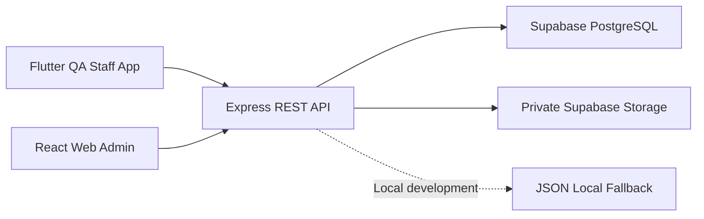

# QA Mobile Apps

QA Mobile Apps is an integrated Quality Assurance system designed to manage **QC Material** and **QC Pekerjaan** workflows.

The system consists of a Flutter application for QA Staff, a React-based Admin Dashboard, an Express API, PostgreSQL, and private object storage.

> Dokumentasi utama: **[Handover Teknis lengkap](docs/HANDOVER.md)**.

## Demo

| Aplikasi | URL |
|---|---|
| Admin Web | [https://qa-mobile-web.vercel.app](https://qa-mobile-web.vercel.app) |
| Mobile Web | [https://qa-mobile-app.vercel.app](https://qa-mobile-app.vercel.app) |

URL tersebut adalah deployment demo yang terdokumentasi. Repository tidak
membuktikan production branch, Root Directory, Build Command, environment
assignment, domain API, maupun pengaturan Vercel lainnya.

## Komponen utama

| Komponen | Pengguna | Tanggung jawab |
|---|---|---|
| QA Staff Mobile App | QA Staff | [Open Mobile Demo](https://qa-mobile-app.vercel.app/) |
| Web Admin Dashboard | Administrator | [Open Admin Demo](https://qa-mobile-web.vercel.app/) |

Demo credentials are displayed on each application's login page.

> The deployments are intended for demonstration and testing. Authentication, account management, security hardening, and several production requirements are still under development.

## System Overview

QA Mobile Apps supports two main actors:

### QA Staff

QA Staff use the Flutter application to:

- View available QC Material and QC Pekerjaan templates.
- Fill numeric, boolean, choice, and text checklist items.
- Add notes and multiple evidence photos to checklist items.
- Save inspections as drafts.
- Restore and continue previously saved drafts.
- Submit completed inspection reports.
- View report history and report details.
- Monitor inspection summaries through the dashboard.
- Manage basic profile information.

QA Staff record inspection data but do not determine the final pass or fail result.

### Administrator

Administrators use the React Web Dashboard to:

- Monitor Quality Control activity.
- Manage QC Material and QC Pekerjaan templates.
- Review reports submitted by QA Staff.
- Inspect checklist answers, notes, and evidence photos.
- Approve or reject inspection reports.
- Determine the final inspection result.
- Filter reports by location, QC type, status, and standard result.
- View report statistics and dashboard summaries.

## Arsitektur dan aliran data


```mermaid
flowchart LR
    Mobile["Flutter QA Staff App"]
    Admin["React Web Admin"]
    API["Express REST API"]
    Database["Supabase PostgreSQL"]
    Storage["Private Supabase Storage"]
    JSON["JSON Local Fallback"]

    Mobile --> API
    Admin --> API
    API --> Database
    API --> Storage
    API -. Local development .-> JSON
```

The mobile and web applications must not access PostgreSQL tables or private storage credentials directly. Database and object-storage credentials are only configured in the Express backend environment.

## Technology Stack

| Layer | Technology |
|---|---|
| QA Staff Application | Flutter / Dart |
| Admin Dashboard | React / TypeScript |
| Backend API | Node.js / Express |
| Database | Supabase PostgreSQL |
| Evidence Storage | Private Supabase Storage |
| Local Data Fallback | JSON |
| Frontend Deployment | Vercel |
| Version Control | Git / GitHub |

## Repository Structure

```text
QA-APPS-MOBILE/
├── apps/
│   ├── mobile/          # Flutter application for QA Staff
│   └── web/             # React Admin Dashboard
├── mock-api/            # Canonical Express API
├── docs/                # Project and integration documentation
└── README.md
```

The deprecated backend previously located at `apps/mobile/mock-api` must not be used. The canonical backend is located at the repository root in `mock-api`.

## Main Workflows

### QC Material

```text
Admin creates a template
        ↓
QA Staff selects the material
        ↓
QA Staff fills checklist items and evidence
        ↓
Report is saved as Draft or Submitted
        ↓
Admin reviews the submitted report
        ↓
Admin approves or rejects the report
```

### QC Pekerjaan

```text
Admin creates a work template
        ↓
QA Staff selects the work inspection
        ↓
QA Staff fills checklist items and evidence
        ↓
Report is saved as Draft or Submitted
        ↓
Admin reviews the submitted report
        ↓
Admin determines the final result
```

## Evidence Photo Management

Evidence photos can be attached to individual checklist items.

The current implementation supports:

- Camera and gallery selection.
- Multiple photos per checklist item.
- Draft photo persistence.
- Upload retry handling.
- Canonical object-path persistence.
- Private storage through the backend.
- Evidence display in report details.
- Removal of newly selected or restored draft photos.

Stored reports persist canonical object paths instead of temporary signed URLs.

## Local Development

### Prerequisites

Install the following tools:

- Node.js and npm
- Flutter SDK
- Android SDK for Android development
- A supported web browser
- Supabase project access when using PostgreSQL and Storage

### Backend API

```powershell
Copy-Item .env.example .env
npm.cmd ci
npm.cmd start
```

Backend lokal berjalan pada `http://localhost:3002` secara default.

### Admin Web - `web`

```powershell
Copy-Item .env.example .env.local
npm.cmd ci
npm.cmd run dev
```

Atur `VITE_API_BASE_URL=http://localhost:3002` di environment lokal. Vite
berjalan pada `http://localhost:5173` secara default.

### Mobile - `feat/mobile-qc-photo-integration`

```powershell
flutter pub get
dart tool/pre_build.dart
flutter run -d chrome --dart-define=API_BASE_URL=http://localhost:3002
```

## Dokumentasi lengkap

**[docs/HANDOVER.md](docs/HANDOVER.md)** adalah sumber utama untuk setup,
testing, deployment, arsitektur, database dan Storage, aturan bisnis, known
issues, technical debt, serta panduan handover.

README ini hanya orientasi awal. Untuk informasi bertanda *perlu dikonfirmasi*
dan batas antara fakta repository dengan rekomendasi operasional, selalu rujuk
ke dokumen handover tersebut.
