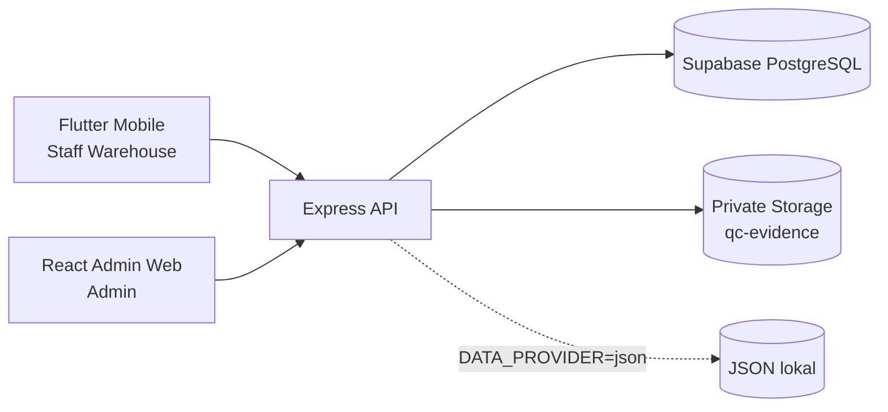
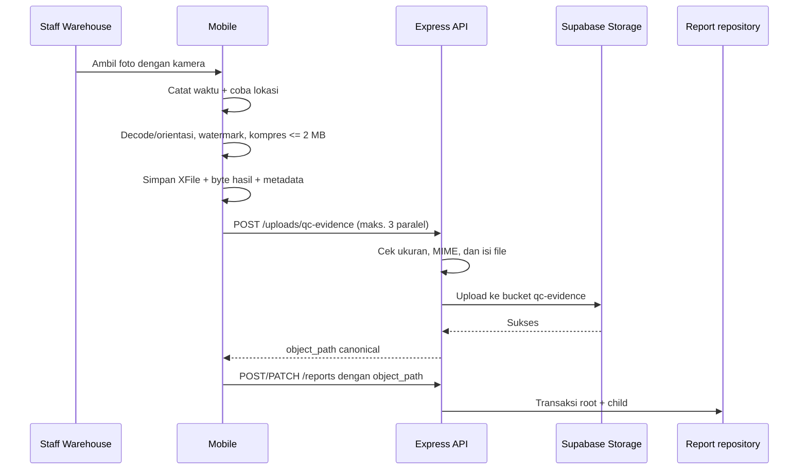
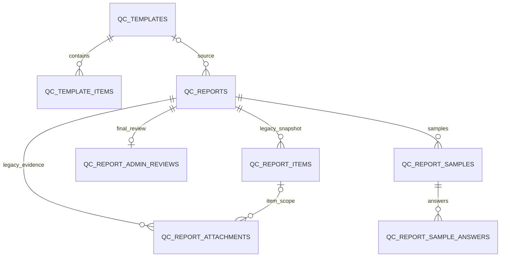

# Handover Teknis QA Mobile Apps

Dokumen ini adalah titik awal teknis untuk pengembang baru. Isinya disusun dari
kode, konfigurasi, migrasi, pengujian, dan riwayat Git yang tersedia pada
workspace `D:\QA-APPS-MOBILE` per **30 Juli 2026 (Asia/Jakarta)**. Dokumen ini
tidak membuktikan kondisi runtime produksi, isi database, atau pengaturan
dashboard Vercel yang tidak disimpan di repository.

## Cara membaca status informasi

- **Terverifikasi** berarti didukung oleh file atau riwayat Git yang diperiksa.
- **Rekomendasi** berarti prosedur yang disarankan, bukan konfigurasi produksi
  yang sudah dibuktikan.
- **Perlu dikonfirmasi** berarti informasi tidak tersedia atau tidak dapat
  dibuktikan dari repository tanpa mengakses layanan eksternal.

Jangan memasukkan URL database, password, service-role key, token Vercel, atau
secret lain ke dokumentasi, log, commit, aplikasi Mobile, atau browser.

## Baseline repository dan branch

Workspace bukan satu working tree Git. Tiga aplikasi aktif berada di tiga
working tree terpisah:

| Komponen | Direktori | Branch aktif | HEAD saat audit | Riwayat |
|---|---|---|---|---|
| Mobile | `apps/mobile` | `feat/mobile-qc-photo-integration` | `43c5cad` | 78 commit; bercabang dari `main` pada `a5ccf64` |
| Admin Web | `apps/web` | `web` | `2883aae` | 31 commit; root commit `627d960` |
| Backend | `mock-api` | `shared-integration` | `b78579c` | 36 commit; root commit `d6883d2` |

Fakta riwayat yang penting:

- `main` pada checkout Mobile berada di `a5ccf64` (14 Juli 2026, 36 commit).
- `feat/mobile-qc-photo-integration` adalah turunan `main` tersebut dan memuat
  implementasi Mobile yang lebih baru, termasuk multi-sampel, sinkronisasi
  status, upload terbatas, metadata lokasi, watermark, dan parsing
  `general_info` terstruktur.
- Branch `web` aktif di `apps/web` dan branch `shared-integration` aktif di
  `mock-api` memiliki root commit yang berbeda dari garis sejarah Mobile.
- Checkout Mobile juga mempunyai ref lokal lama bernama `web` (`be709b3`) dan
  `shared-integration` (`cd553a1`). Ref itu **bukan** baseline aplikasi aktif di
  dua working tree lainnya. Jangan memakai ref lama tersebut untuk deployment
  atau perbandingan implementasi.
- Direktori workspace `D:\QA-APPS-MOBILE` sendiri tidak dikenali sebagai
  working tree Git. Jalankan status, diff, commit, dan tag dari masing-masing
  direktori aplikasi.

Konsekuensinya, `main` tidak boleh dianggap sebagai gabungan terbaru ketiga
aplikasi. Integrasi sejarah yang tidak berhubungan memerlukan strategi khusus;
jangan melakukan merge paksa hanya untuk menyatukan branch.

## 1. Gambaran proyek

QA Mobile Apps adalah prototipe alur Quality Control untuk:

- **QC Material**, termasuk informasi pengadaan, beberapa sampel, evaluasi
  standar, catatan, dan bukti foto per parameter.
- **QC Pekerjaan**, yaitu pemeriksaan pekerjaan berdasarkan template dan
  segmen.

Pembagian tanggung jawab yang terverifikasi:

| Lapisan | Tanggung jawab |
|---|---|
| Flutter Mobile | Entri Staff Warehouse, pengambilan dan pemrosesan foto, draft/submit, riwayat, revisi |
| React Admin Web | Daftar dan detail laporan, presentasi bukti, review per parameter/sampel, approval atau tindak lanjut |
| Express Backend | Kontrak REST, validasi/normalisasi, transaksi laporan, signed URL, dan batas ke database/Storage |
| Supabase PostgreSQL | Data template, laporan, sampel, jawaban, review, dan relasi |
| Supabase Storage | Objek bukti privat pada bucket `qc-evidence` |
| JSON provider | Persistensi file lokal untuk pengembangan Backend, bukan sumber produksi |

Arsitektur yang dimaksud:



Mobile dan Web tidak mempunyai kode akses langsung ke tabel Supabase. Backend
memegang koneksi PostgreSQL dan service-role Storage. RLS diaktifkan pada tabel
aplikasi tanpa policy publik pada migrasi awal.

### Batas prototipe

Deployment saat ini adalah kandidat prototipe/pilot dan **belum
production-ready**. Login masih simulasi, otorisasi role belum ditegakkan oleh
Backend, observability dan prosedur operasi belum lengkap, dan konfigurasi
production branch/root Vercel tidak tersimpan di repository. Integrasi AI yang
disebut di README masih rencana; tidak ada keputusan QC otomatis berbasis AI
yang terverifikasi di implementasi aktif.

## 2. Peta aplikasi aktif

| Komponen | Source branch | Layout lokal | URL yang terdokumentasi | Platform | Production branch | Root/build yang terverifikasi |
|---|---|---|---|---|---|---|
| Mobile | `feat/mobile-qc-photo-integration` | `apps/mobile` | `https://qa-mobile-app.vercel.app/` | Vercel disebut di README | **Perlu dikonfirmasi** di Vercel | Root source berisi `pubspec.yaml`; build Web production membutuhkan `--dart-define=API_BASE_URL=...`; pengaturan Root Directory/Build Command Vercel perlu dikonfirmasi |
| Admin Web | `web` | `apps/web` | `https://qa-mobile-web.vercel.app/` | Vercel; project lokal tertaut bernama `qa-mobile-web` | **Perlu dikonfirmasi** di Vercel | `npm run build` menjalankan `tsc -b && vite build`; output Vite `dist`; `vercel.json` hanya berisi SPA rewrite |
| Backend | `shared-integration` | `mock-api` | **Perlu dikonfirmasi**; project lokal tertaut bernama `qa-mobile-api` | Vercel terindikasi oleh link lokal dan `@vercel/functions` | **Perlu dikonfirmasi** di Vercel | Node `>=22`; `npm start` menjalankan `src/server.js`; tidak ada `vercel.json`, sehingga build/root/entrypoint produksi perlu dikonfirmasi |
| Supabase | bukan branch aplikasi | migrasi di `mock-api/supabase/migrations` | **Perlu dikonfirmasi** | Supabase | tidak berlaku | Project ref, region, dan environment aktif sengaja tidak didokumentasikan |

URL Mobile dan Web di atas berasal dari README aktif. Repository tidak memuat
URL API produksi yang dapat diverifikasi. Nama project dalam `.vercel` adalah
metadata lokal yang di-ignore, bukan bukti production domain atau production
branch.

## 3. Arsitektur dan aliran data

### Capture, lokasi, dan draft Mobile

Alur QC Material saat ini:

1. Step 1 mengumpulkan lokasi kerja dan informasi pengadaan.
2. `sample_count` menentukan Step 2 sampai Step N+1 untuk Sampel 1 sampai N.
3. Setiap sampel mempunyai object state sendiri: ID, nomor, status inspeksi,
   jawaban, catatan sampel, foto, byte preview, dan metadata foto.
4. Foto dipilih dengan `ImageSource.camera`; jalur QC Material tidak menawarkan
   gallery.
5. Setelah kamera menghasilkan `XFile`, Mobile mencatat `capturedAt` dan
   mencoba lokasi. Lokasi memakai cache maksimum 60 detik, akurasi tinggi, dan
   timeout fresh position 8 detik. Kegagalan lokasi tidak membatalkan foto.
6. Processor membaca file sekali, mendeteksi HEIC/HEIF, mengonversi bila perlu,
   memperbaiki orientasi, membakar watermark, lalu mengompresi JPEG hingga
   maksimum 2 MB. Byte hasil disimpan di `localItemPhotoBytes` untuk preview
   dan upload.
7. Saat `Simpan Draft` atau submit, Mobile menunggu foto yang masih diproses,
   mengunggah foto baru, membangun snapshot laporan, lalu memanggil
   `POST /reports` atau `PATCH /reports/:id`.

Draft laporan QC Material pada implementasi aktif adalah draft yang dikirim ke
Backend setelah upload selesai. `DummyState` hanya menyimpan cache laporan di
memori; penggunaan `SharedPreferences` yang terverifikasi hanya untuk foto
profil. Karena itu, jangan menganggap ada offline durable draft blob untuk foto
QC Material.

### Pemrosesan dan upload bukti

Urutan pemrosesan satu foto:



Worker pool Mobile membatasi maksimal tiga upload bersamaan. Indexed result
diterapkan kembali secara deterministik supaya asosiasi sampel, checklist item,
dan posisi foto tidak berubah. Foto yang sudah berupa canonical object path
tidak di-upload ulang. Cache `_uploadedObjectPaths` mempertahankan upload yang
berhasil selama instance form masih hidup, sehingga retry hanya mencoba upload
yang belum selesai. Report POST/PATCH tidak dikirim bila salah satu upload
gagal.

Durasi submit tetap bergantung pada jumlah byte bukti, uplink perangkat,
latensi Storage, dan foto paling lambat. Semua upload harus selesai sebelum
laporan dipersistenkan; tidak ada background upload, resumable upload, atau
deferred draft synchronization.

### Canonical object path dan signed URL

Backend hanya menerima bentuk:

```text
reports/<report-id>/general/<uuid>.<ext>
reports/<report-id>/checklist/<checklist-item-id>/<uuid>.<ext>
```

Ekstensi yang diizinkan kontrak adalah `jpg`, `png`, `webp`, atau `heic`.
Report menyimpan object path tersebut, bukan `http(s)`, `blob:`, `data:`, local
path, atau signed URL.

Admin Web mengumpulkan canonical path dari report, meminta signed URL melalui
`POST /uploads/qc-evidence/signed-urls`, lalu menyimpan URL tampilan di
`evidenceDisplayUrls`. Payload review dikembalikan dengan canonical path.
Signed URL berlaku 3.600 detik pada implementasi Storage saat ini.

### `qcEvidenceCaptureMetadata`

Lokasi publik field adalah:

```json
{
  "general_info": {
    "qcEvidenceCaptureMetadata": {
      "reports/<report>/checklist/<item>/<uuid>.jpg": {
        "capturedAt": "ISO-8601 dengan offset",
        "latitude": -6.2088,
        "longitude": 106.8456,
        "accuracyMeters": 3.25,
        "locationLabel": null,
        "serverReceivedAt": "ISO-8601 UTC dari Backend"
      }
    }
  }
}
```

Kunci metadata adalah canonical object path yang sama dengan `photo_paths`.
Backend membersihkan timestamp/koordinat/akurasi/label yang tidak valid,
menambahkan `serverReceivedAt` pada penerimaan pertama, dan mempertahankannya
pada PATCH. Admin Web mencari metadata dengan object path asli; signed URL
hanya untuk ``.

**Temuan integrasi yang perlu ditindaklanjuti:** kontrak dan tes Backend/Web
menggunakan object terstruktur seperti contoh di atas, tetapi
`QCMaterialFormProvider._persistReport()` saat audit membangun
`Map<String, String>` dan memasukkan metadata sebagai hasil `jsonEncode`.
Backend menormalkan container non-object menjadi `{}`, sedangkan Admin Web juga
mengharapkan object. Perlu dikonfirmasi dengan capture payload aktual dan
report produksi; jika payload masih berupa string, ini adalah mismatch
serialization yang harus diperbaiki sebagai task terpisah.

Metadata dan watermark adalah bukti bantu, bukan bukti anti-tamper. Backend
tidak melakukan reverse geocoding dan tidak memakai metadata untuk pass/fail.

### Submit dan siklus review

Status root yang didukung adalah:

| Status | Arti |
|---|---|
| `DRAFT` | Belum diajukan |
| `SUBMITTED` | Menunggu review Admin |
| `NEEDS_FOLLOW_UP` | Admin meminta tindak lanjut/revisi |
| `APPROVED` | Admin menyetujui |

Staff Warehouse membuat atau mengirim ulang laporan sebagai `SUBMITTED`; data
sampling, STOP, failed samples, dan review request tetap metadata terpisah.
Mobile tidak mengisi kesimpulan final Admin.

Admin Web hanya menampilkan laporan non-`DRAFT` dalam list. Pada laporan
`SUBMITTED`, Admin dapat:

- mengubah `admin_evaluation` dan `admin_note` per kombinasi sample ID dan
  checklist item ID;
- meminta revisi menjadi `NEEDS_FOLLOW_UP` dengan
  `admin_review.conclusion = NOT_PASSED`;
- menyetujui menjadi `APPROVED` dengan
  `admin_review.conclusion = PASSED`.

Approval tidak diblokir oleh `PASS`, `FAIL`, atau `NEEDS_REVIEW`; status root
harus processable. Request revision tetap memerlukan catatan laporan, minimal
satu parameter `FAIL`, dan Catatan Admin non-kosong pada setiap parameter
gagal. Mobile me-refresh `GET /reports/:id` saat detail dibuka agar status dan
catatan revisi terbaru menggantikan cache list.

Database mempunyai deferred trigger
`public.validate_qc_report_final_conclusion()`: `NEEDS_FOLLOW_UP` dan
`APPROVED` harus mempunyai conclusion eksplisit; `DRAFT` dan `SUBMITTED` tidak
wajib. Status tidak otomatis menentukan nilai conclusion.

## 4. Role dan permission

### `STAFF_WAREHOUSE`

- Memilih template dan lokasi.
- Mengisi informasi pengadaan, jawaban, catatan, dan foto.
- Menyimpan draft dan submit/re-submit.
- Melihat status workflow serta instruksi revisi.
- Tidak menentukan `admin_evaluation` atau final conclusion.

### `ADMIN`

- Melihat laporan yang telah diajukan.
- Meninjau conformity hasil inspeksi sebagai informasi.
- Mengisi keputusan dan catatan Admin per parameter/sampel.
- Meminta revisi atau menyetujui laporan.
- Menentukan final conclusion.

### Batas keamanan yang terverifikasi

- Mobile memakai `DummyAuth` dan user dari `DummyState`; tidak ada sesi server
  yang terverifikasi.
- Admin Web memeriksa flag `isAdminLoggedIn` di `localStorage`; Login Page
  memakai kredensial demo hard-coded.
- Route Express tidak memasang middleware authentication atau authorization.
- CORS, validasi body, validasi kontrak, RLS, dan service-role boundary **bukan
  pengganti autentikasi/otorisasi pengguna**.

Dengan kondisi tersebut, pembatasan role saat ini terutama merupakan
pembatasan UI/kontrak, bukan enforcement identitas end-to-end. Production
memerlukan identity provider, sesi aman, dan pemeriksaan role di Backend.

## 5. Setup lokal

### Prasyarat

- Git.
- Flutter SDK dengan Dart yang memenuhi `sdk: ^3.12.2`.
- Node.js 22 atau lebih baru dan npm. Backend menetapkan `node >=22`; versi ini
  juga menjadi baseline aman untuk tool Web saat ini.
- Browser yang didukung Flutter/Vite.
- Android SDK dan emulator bila menjalankan Android.
- Xcode/iOS toolchain untuk build iOS; **Perlu dikonfirmasi** pada host macOS
  yang akan digunakan.
- Akses Supabase hanya bila menguji PostgreSQL atau upload Storage.
- Supabase CLI bila menjalankan migrasi lokal.

Gunakan terminal terpisah untuk Backend, Web, dan Mobile.

### Backend

```powershell
cd D:\QA-APPS-MOBILE\mock-api
Copy-Item .env.example .env
npm.cmd ci
npm.cmd start
```

Server lokal default berada di `http://localhost:3002`. Untuk auto-reload:

```powershell
npm.cmd run dev
```

`DATA_PROVIDER=json` memakai `data/templates.json` dan `data/reports.json`.
Mode tersebut tidak memerlukan PostgreSQL. Upload foto tetap memerlukan
`STORAGE_PROVIDER=supabase`, `SUPABASE_URL`, dan
`SUPABASE_SERVICE_ROLE_KEY`. Jika Storage tidak dikonfigurasi, pengujian laporan
tanpa upload masih dapat berjalan, tetapi endpoint bukti akan mengembalikan
service unavailable.

### Admin Web

```powershell
cd D:\QA-APPS-MOBILE\apps\web
Copy-Item .env.example .env.local
npm.cmd ci
npm.cmd run dev
```

Vite memakai `http://localhost:5173` secara default. Isi
`VITE_API_BASE_URL=http://localhost:3002` untuk Backend lokal.

### Mobile

```powershell
cd D:\QA-APPS-MOBILE\apps\mobile
flutter pub get
dart tool/pre_build.dart
flutter run -d chrome --dart-define=API_BASE_URL=http://localhost:3002
```

`run_chrome.bat` dan `run_chrome.sh` menjalankan pemeriksaan symlink lalu
`flutter run -d chrome`, tetapi tidak menyuntikkan API URL. Tanpa
`API_BASE_URL`, debug Flutter Web/Desktop memakai `http://localhost:3002`.
Android emulator memakai `http://10.0.2.2:3002`. Perangkat fisik perlu alamat
LAN host yang dapat dijangkau:

```powershell
flutter run -d <device-id> --dart-define=API_BASE_URL=http://<IP-LAN>:3002
```

Build Flutter Web release wajib memakai API HTTPS absolut:

```powershell
flutter build web --release --dart-define=API_BASE_URL=https://<API-HTTPS>
```

### Environment variable

Nilai berikut adalah nama dan fungsi saja; gunakan secret manager untuk nilai
produksi.

| Aplikasi | Nama | Fungsi |
|---|---|---|
| Mobile | `API_BASE_URL` | Compile-time base URL Express API |
| Web | `VITE_API_BASE_URL` | Base URL Express API yang diekspos ke bundle browser |
| Backend | `PORT` | Port server, default 3002 |
| Backend | `CORS_ORIGINS` | Daftar origin Mobile Web/Admin yang boleh memanggil API |
| Backend | `DATA_PROVIDER` | `json` atau `postgres` |
| Backend | `DATABASE_URL` | Supabase PostgreSQL/pooler URL; backend-only |
| Backend | `DATABASE_POOL_MAX` | Maksimum client pool, default 2 |
| Backend | `DATABASE_CONNECTION_TIMEOUT_MS` | Timeout checkout/connect, default 10.000 ms |
| Backend | `DATABASE_IDLE_TIMEOUT_MS` | Timeout idle client, default 30.000 ms |
| Backend | `DATABASE_KEEP_ALIVE` | TCP keep-alive |
| Backend | `DATABASE_SSL` | Aktif/nonaktif SSL |
| Backend | `DATABASE_SSL_REJECT_UNAUTHORIZED` | Verifikasi sertifikat TLS |
| Backend | `STORAGE_PROVIDER` | Provider objek; implementasi aktif hanya Supabase |
| Backend | `SUPABASE_URL` | Endpoint project Supabase untuk Storage |
| Backend | `SUPABASE_SERVICE_ROLE_KEY` | Credential server untuk private Storage |

`VERCEL` dibaca Backend untuk registrasi pool serverless, tetapi diharapkan
disuntikkan platform, bukan disimpan di `.env.example`. File `.env`,
`.env.local`, dan `.vercel` di-ignore. Jangan menyalin token lokal Vercel ke
dokumentasi.

### Route API

Route yang terverifikasi:

```text
GET    /health
GET    /reports
GET    /reports/:id
POST   /reports
PATCH  /reports/:id
DELETE /reports/:id
GET    /templates
GET    /templates/:id
POST   /templates
PATCH  /templates/:id
DELETE /templates/:id
POST   /templates/:templateId/items
PATCH  /templates/:templateId/items/:itemId
DELETE /templates/:templateId/items/:itemId
POST   /uploads/qc-evidence
POST   /uploads/qc-evidence/signed-urls
```

## 6. Testing dan validasi

### Mobile

Contoh focused test berdasarkan area aktif:

```powershell
cd D:\QA-APPS-MOBILE\apps\mobile
flutter test test/shared/providers/qc_material_form_provider_test.dart
flutter test test/shared/providers/qc_material_multi_step_provider_test.dart
flutter test test/shared/providers/qc_material_sample_evaluation_test.dart
flutter test test/shared/providers/qc_material_upload_concurrency_test.dart
flutter test test/shared/services/qc_capture_location_service_test.dart
flutter test test/shared/services/qc_photo_watermark_test.dart
flutter test test/core/services/api_service_test.dart
```

Suite, analyzer, format check, dan build:

```powershell
flutter test
flutter analyze
dart format --output=none --set-exit-if-changed lib test
flutter build web --release --dart-define=API_BASE_URL=https://example.invalid
git diff --check
```

Test berada di `apps/mobile/test`. Gunakan URL `.invalid` hanya untuk memvalidasi
build; jangan deploy artefak tersebut.

### Admin Web

Focused test:

```powershell
cd D:\QA-APPS-MOBILE\apps\web
node --test test/material-report-presentation.test.ts
node --test test/qc-evidence-capture-metadata.test.ts
node --test test/report-trend.test.ts
node --test test/roles.test.ts
```

Suite, typecheck, lint, dan build:

```powershell
node --test test/*.test.ts
npx.cmd tsc -p test/tsconfig.json --noEmit
npx.cmd tsc -b
npm.cmd run lint
npm.cmd run build
git diff --check
```

`package.json` saat ini hanya mempunyai shortcut `test:roles`; complete suite
dipanggil langsung melalui `node --test`.

### Backend

Focused test yang paling relevan terhadap integrasi:

```powershell
cd D:\QA-APPS-MOBILE\mock-api
node --test test/repositories/multi-sample-reports.test.js
node --test test/repositories/sample-admin-reviews.test.js
node --test test/repositories/qc-evidence-upload.test.js
node --test test/repositories/qc-evidence-capture-metadata.test.js
node --test test/repositories/postgres-report-read-retry.test.js
node --test test/repositories/transactions.test.js
```

Suite dan check:

```powershell
npm.cmd test
npm.cmd run check
git diff --check
```

Test repository memakai mock pool dan file temporary; tidak membutuhkan koneksi
Supabase.

### Smoke test manual

Gunakan environment non-produksi dengan data uji:

1. Pastikan `/health` hidup dan provider yang dilaporkan sesuai environment.
2. Muat template QC Material dan QC Pekerjaan di Mobile.
3. Buat QC Material dua atau lebih sampel; pastikan jawaban/catatan/foto tidak
   bocor antar sampel.
4. Ambil foto kamera dengan lokasi tersedia dan tidak tersedia; periksa
   watermark, preview, ukuran akhir, dan pesan fallback.
5. Simpan draft, tutup/buka kembali, dan periksa urutan sampel, jawaban,
   catatan, foto, serta metadata.
6. Submit; pastikan satu object path per foto dan tidak ada URL signed pada
   report payload.
7. Buka Admin Web; pastikan sampel berurutan, conformity Mobile read-only, dan
   keputusan Admin independen.
8. Uji Catatan Admin per sampel/parameter, request revision, dan approval.
9. Refresh detail Mobile; pastikan `NEEDS_FOLLOW_UP`, catatan revisi, dan banner
   STOP sampling tidak saling menggantikan.
10. Uji retry dengan satu upload gagal; upload yang sudah berhasil tidak boleh
    berulang selama form yang sama tetap hidup.
11. Periksa legacy report tanpa `samples` dan tanpa capture metadata.
12. Jalankan ulang test/check/build terkait sebelum menyerahkan perubahan.

## 7. Deployment

### Kondisi yang dapat dibuktikan

- README aktif menunjuk Mobile dan Admin Web ke domain Vercel.
- Web mempunyai `vercel.json` untuk SPA rewrite dan link project lokal
  `qa-mobile-web`.
- Backend memakai `@vercel/functions` untuk lifecycle pool dan mempunyai link
  project lokal `qa-mobile-api`.
- Mobile tidak mempunyai `vercel.json` atau link `.vercel` pada checkout yang
  diaudit.
- Tidak ditemukan workflow CI di `.github` pada tiga working tree.
- Production branch, Root Directory, Build Command, Output Directory,
  environment assignment, domain API, dan auto-deploy policy:
  **Perlu dikonfirmasi di dashboard Vercel**.

### Prosedur deployment aman

Bagian ini adalah **rekomendasi**, bukan bukti konfigurasi produksi:

1. Mulai dari working tree dan branch komponen yang benar; catat HEAD.
2. Pastikan working tree bersih dan perubahan tidak mencampur aplikasi lain.
3. Jalankan focused test, complete suite, typecheck/analyze, lint/check, build,
   dan `git diff --check`.
4. Buat PR ke branch yang memang dikonfigurasi sebagai production branch.
   Jangan mengasumsikan branch tersebut sebelum mengecek dashboard.
5. Gunakan preview deployment dan environment non-produksi terlebih dahulu.
6. Verifikasi API base URL, CORS origin, provider data, Storage, dan health tanpa
   mencetak secret.
7. Jalankan smoke test create → upload → submit → review → refresh.
8. Minta approval sebelum promote ke produksi; dokumentasikan deployment ID,
   commit SHA, waktu, dan operator.
9. Jangan mengubah project link, domain, Root Directory, environment variable,
   Supabase project, atau production alias sebagai bagian dari pekerjaan
   dokumentasi.

Rollback Vercel yang tepat **perlu dikonfirmasi** dengan akses project. Secara
operasional, siapkan redeploy/promote deployment terakhir yang telah
diverifikasi, lalu cocokkan kembali environment dan smoke test. Rollback schema
yang sudah diterapkan harus menggunakan migrasi kompensasi; jangan reset
database produksi.

## 8. Aturan bisnis penting

### Bukti foto

- QC Material menggunakan kamera saja.
- Timestamp diambil saat capture, bukan saat upload.
- Lokasi dicoba satu kali per capture; cache maksimum 60 detik dan fresh
  position timeout 8 detik.
- Capture tetap berhasil tanpa lokasi; watermark menampilkan
  `Lokasi tidak tersedia`.
- Watermark memakai waktu capture yang sama dengan metadata, koordinat enam
  desimal, akurasi, serta label bila tersedia.
- HEIC/HEIF dikonversi ke JPEG, orientasi dibetulkan, watermark ditambahkan,
  dan output akhir dikompresi sampai maksimum 2 MB.
- Byte hasil dipakai kembali untuk preview dan upload; submit tidak seharusnya
  mengulang watermark atau kompresi.
- Backend kembali memeriksa MIME, signature file, dan batas 2 MB.

### QC Material multi-sampel

- Step 1 adalah informasi umum/pengadaan.
- Step berikutnya adalah Sampel 1 sampai N.
- Identitas sample ID dan checklist item ID menentukan jawaban dan review.
- Setiap sampel mempunyai jawaban, catatan, `inspection_status`,
  `evaluation_status`, foto, serta keputusan/catatan Admin independen.
- Urutan API disimpan melalui `sample_number` dan kolom `position`.
- Legacy report tanpa sampel tetap dibaca dengan `sample_count` default 1 dan
  array sampel kosong.

### Evaluasi standar

- Numeric memakai `minimum_value`/`maximum_value` dari template/bounds; pengguna
  tidak menghitung toleransi persen secara manual.
- Choice memakai outcome pilihan `PASS`/`FAIL`.
- Boolean mengenali nilai sesuai/tidak sesuai.
- Text/photo tanpa aturan evaluasi tetap `NOT_EVALUATED`.
- Label persistennya `WITHIN_STANDARD`, `OUT_OF_STANDARD`, dan
  `NOT_EVALUATED`.
- Conformity Mobile adalah informasi inspeksi. Keputusan Admin
  `PASS`/`FAIL`/`NEEDS_REVIEW` adalah field berbeda dan tidak boleh diturunkan
  dari conformity.
- Backend dan Admin Web tidak menghitung ulang keputusan sampling atau
  conformity yang dikirim Mobile.

### Warning, STOP, dan review

Setelah minimal dua **sampel selesai** berstatus `OUT_OF_STANDARD`, provider
menandai keputusan sampling diperlukan. UI membuka dialog untuk mencatat
`CONTINUE` atau `STOP`; STOP memerlukan alasan. Simpan draft tetap tersedia.
Pada titik navigasi tersebut, perpindahan ke sampel berikutnya menunggu
keputusan sampling dicatat. Ini adalah keputusan inspeksi Mobile, bukan final
conclusion Admin.

Report menyimpan flag/timestamp review request, failed sample IDs dan numbers,
sampling decision, STOP reason, dan snapshot jawaban. Admin tetap berwenang
meminta revisi atau menyetujui laporan. Approval tidak mengubah parameter gagal
secara otomatis.

### Draft, retry, dan duplikasi

- Draft dan submit memakai pipeline upload yang sama.
- Canonical path dilewati tanpa upload ulang.
- Maksimum tiga upload baru berjalan bersamaan.
- Hasil dipetakan kembali berdasarkan index, bukan urutan selesainya request.
- Upload sukses di-cache untuk retry dalam instance form.
- Kegagalan upload mencegah POST/PATCH report.
- Guard `_isPersisting` dan capture-in-progress mencegah aksi duplikat pada
  instance provider yang sama.
- Tidak ada background upload atau local durable blob store.

## 9. Database dan Storage

### Tabel dan relasi



- Template deletion menghapus template items, tetapi `qc_reports.template_id`
  menjadi null agar snapshot historis bertahan.
- Report deletion cascade ke item, review, attachment, sample, dan sample
  answers.
- `qc_report_sample_answers` mempunyai primary key
  `(report_id, sample_id, checklist_item_id)`.
- Admin review per sampel disimpan pada kolom `admin_evaluation` dan
  `admin_note` di sample answer.
- `actual_value` sample answer memakai JSONB agar number, boolean, string, dan
  null tidak dipaksa menjadi satu tipe.

### `general_info` dan kompatibilitas

`qc_reports.general_info` adalah JSONB object untuk informasi yang bervariasi
antar tipe laporan. `qcEvidenceCaptureMetadata` tetap berada di dalam object
ini; tidak ada kolom khusus. Metadata migrasi, exact validation value, dan
attachment metadata juga memakai JSONB untuk tujuan masing-masing.

Backend mempertahankan alias legacy tertentu, root `checklist_items`, attachment
legacy, report tanpa `samples`, dan report tanpa capture metadata. Root
checklist tetap ada untuk QC Pekerjaan dan kompatibilitas; sample-native QC
Material memakai tabel sample.

### Storage

- Bucket: `qc-evidence`.
- Bucket dibuat private oleh migrasi.
- Prefix canonical: `reports/`.
- Subpath: `general/<uuid>` atau `checklist/<item-id>/<uuid>`.
- API upload mengizinkan satu file per request dan maksimal 2 MB.
- Migrasi bucket `20260715000200_create_qc_evidence_storage_bucket.sql` masih
  menetapkan bucket-level limit 10 MB; batas API 2 MB lebih ketat. Sinkronisasi
  limit bucket adalah technical debt, bukan alasan melemahkan API.
- `DELETE /reports/:id` menghapus record database, tetapi repository delete
  tidak memanggil Storage. Pembersihan object `reports/` perlu prosedur
  eksplisit agar tidak meninggalkan orphan.

### Migrasi rujukan

| File | Tujuan |
|---|---|
| `20260714000100_create_core_qa_schema.sql` | Tabel inti, RLS, trigger final conclusion |
| `20260715000100_repair_template_segments_and_standard_text.sql` | Repair template |
| `20260715000200_create_qc_evidence_storage_bucket.sql` | Bucket private `qc-evidence` |
| `20260716000100_add_qc_template_item_input_contract.sql` | Kontrak tipe input template |
| `20260717000100_repair_qc_material_categories.sql` | Repair kategori material |
| `20260722000100_backfill_qc_material_numeric_bounds.sql` | Bounds numeric terstruktur |
| `20260723000100_add_qc_report_samples.sql` | Sample, sample answers, canonical photo paths |
| `20260723000200_add_qc_material_review_requests.sql` | Snapshot review request dan failed samples |
| `20260727000100_add_sample_admin_reviews.sql` | Review Admin per sample answer |

Urutan dan status penerapan migrasi pada project Supabase produksi:
**Perlu dikonfirmasi**. Jangan menjalankan `supabase db reset` terhadap
environment bersama atau produksi.

## 10. Known issues dan technical debt

1. **Topologi branch/repository.** Tiga working tree dan garis sejarah berbeda
   membuat `main` bukan sumber gabungan. Ref `web`/`shared-integration` di
   checkout Mobile sudah tertinggal.
2. **Dokumentasi lama bertentangan.** `docs/architecture.md`,
   `docs/api/report-contract.md`, handoff 15 Juli, dan beberapa PRD masih
   menyatakan Storage belum diimplementasikan. Web README juga masih memakai
   istilah QA Staff dan menyebut gallery. Kode aktif membuktikan endpoint
   Storage dan camera-only QC Material sudah ada.
3. **Authentication/authorization.** Mobile dummy user, Web localStorage login,
   dan route Backend tanpa auth middleware belum layak produksi.
4. **Mismatch metadata potensial.** Mobile provider mengirim metadata sebagai
   JSON string, sementara kontrak Backend/Web mengharapkan object. Capture
   payload dan record produksi perlu dikonfirmasi sebelum menyatakan metadata
   end-to-end selesai.
5. **State draft lokal.** Report cache berada di memori; tidak ada durable
   offline photo/draft store QC Material.
6. **File Mobile besar.** `qc_material_form_provider.dart` sekitar 1.836 baris
   dan `qc_material_form_screen.dart` sekitar 1.259 baris. Refactor harus
   didahului characterization test karena keduanya memegang banyak invariant.
7. **Upload latency.** Concurrency tiga mengurangi waktu dibanding serial,
   tetapi draft/submit tetap menunggu seluruh bukti. Durasi produksi bergantung
   pada total ukuran bukti dan uplink.
8. **Storage cleanup.** Delete report tidak menghapus object bukti.
9. **Limit Storage tidak seragam.** Bucket migration 10 MB, kontrak API/Mobile
   2 MB.
10. **Deployment metadata tidak lengkap.** Production branch, Root Directory,
    API domain, environment assignment, dan rollback runbook tidak ada dalam
    repository.
11. **CI belum tersedia.** Tidak ditemukan workflow `.github`; quality gate
    masih manual.
12. **Observability.** Logging masih dominan console; centralized logging,
    metrics, tracing, alerting, dan audit trail operasional perlu dirancang.
13. **Operational readiness.** Rate limiting, backup/recovery drill, security
    review, full E2E/device test, load test, dan deployment documentation masih
    diperlukan.

## 11. Workflow perubahan yang aman

1. Jalankan `git status --short --branch` di ketiga working tree sebelum mulai.
2. Pilih satu aplikasi dan satu tanggung jawab per task.
3. Tulis atau jalankan characterization test sebelum refactor struktural.
4. Buat perubahan terkecil; jangan mengubah kontrak lintas aplikasi tanpa
   pengujian consumer dan provider.
5. Jalankan focused test selama iterasi, lalu complete suite dan build.
6. Periksa `git diff --check`, `git diff --stat`, dan diff file demi file.
7. Stage path eksplisit; pisahkan commit Mobile, Web, dan Backend.
8. Jangan menggabungkan unrelated histories, menimpa perubahan lokal, atau
   memindahkan kode lewat branch lama tanpa review.
9. Jangan mengubah Vercel link/settings, secret, Supabase data, Storage object,
   atau migration state dari task aplikasi biasa.
10. Buat PR dengan ringkasan kontrak, risiko, hasil test eksak, screenshot bila
    UI, dan rollback plan.

**Rekomendasi CI:** buat workflow per aplikasi dengan path filter. Mobile
menjalankan test/analyze/build, Web menjalankan Node tests/typecheck/lint/build,
dan Backend menjalankan test/check. Preview deployment harus menjadi gate
sebelum production approval.

## 12. Checklist hari pertama

1. Baca dokumen ini dan tandai semua bagian **Perlu dikonfirmasi** yang relevan.
2. Verifikasi tiga direktori Git, branch, remote, HEAD, dan status masing-masing.
3. Jangan memakai `main` atau ref lokal lama sebagai baseline Web/Backend.
4. Salin `.env.example` lokal tanpa memasukkan secret ke Git.
5. Jalankan Backend dengan `DATA_PROVIDER=json`; cek `GET /health`.
6. Jalankan Admin Web dan pastikan list/report route dapat mencapai Backend.
7. Jalankan Mobile Chrome dengan `API_BASE_URL` lokal.
8. Jalankan satu focused test dan complete suite pada setiap aplikasi.
9. Lakukan smoke test satu laporan tanpa foto, lalu satu laporan dengan foto di
   environment non-produksi.
10. Pelajari `report.contract.js`, `qc_material_form_provider.dart`,
    `ReportsContext.tsx`, dan migrasi sample/review sebelum mengubah workflow.
11. Konfirmasi project/branch/root Vercel dan project Supabase kepada pemilik
    sistem; jangan mengubahnya.
12. Ambil satu task kecil, buat PR terfokus, dan sertakan hasil validasi eksak.
